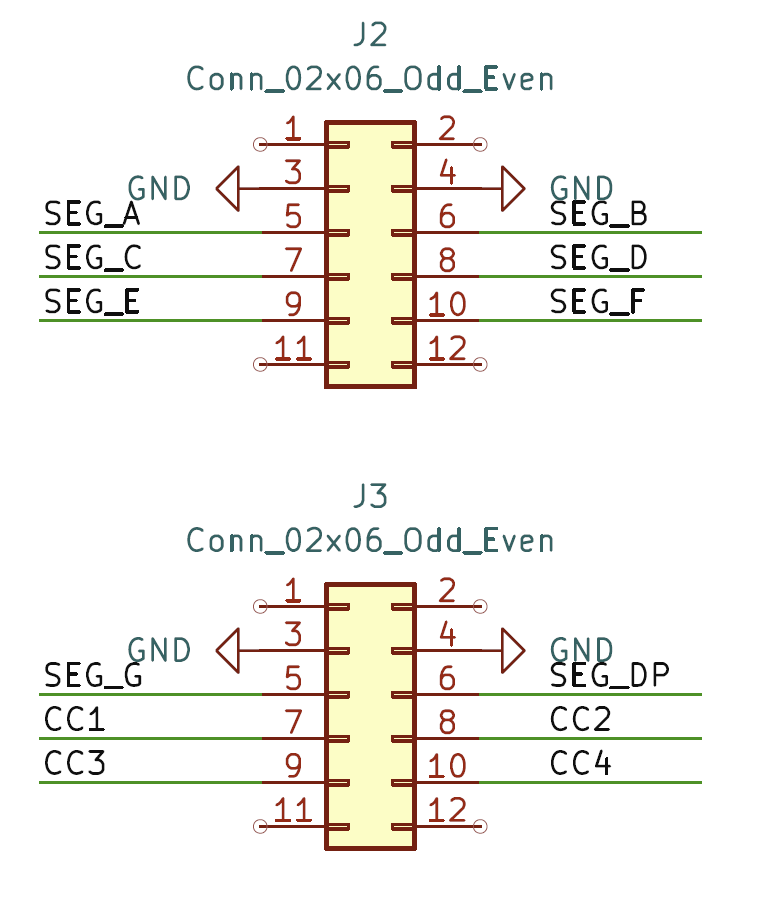

# led_seg_display

# Purpose

Driving 4 digits LED segment display in dynamic scan mode. Implement a counter with counting clock of 1Hz, and display the value of this counter in hexadecimal.

# Key Signals

Schematic for LED seg display expansion board:

[led_seg_display_sch_v1p0.pdf](./ref/led_seg_display_sch_v1p0.pdf)

The interface is defined as followings:

Signal Definition

In case LED board is inserted to PMOD2/PMOD3 like this:

| Signal on LED board | FPGA Pin | Function                                        |
| ------------------- | -------- | ----------------------------------------------- |
| SEG_A               | N8       | Segment A for all digits                        |
| SEG_B               | L9       | Segment B for all digits                        |
| SEG_C               | N7       | Segment C for all digits                        |
| SEG_D               | N9       | Segment D for all digits                        |
| SEG_E               | D11      | Segment E for all digits                        |
| SEG_F               | N6       | Segment F for all digits                        |
| SEG_G               | C12      | Segment G for all digits                        |
| SEG_DP              | B12      | Segment DP for all digits                       |
| CC1                 | A14      | Common Cathode of Digit 1, High Level to enable |
| CC2                 | B13      | Common Cathode of Digit 2, High Level to enable |
| CC3                 | A15      | Common Cathode of Digit 3, High Level to enable |
| CC4                 | B14      | Common Cathode of Digit 4, High Level to enable |

Other Signal on TangPrimer20K

| Signal on TangPrimer20K | FPGA Pin | Function                                             |
| ----------------------- | -------- | ---------------------------------------------------- |
| MCLK                    | H11      | Main Clock, Frequency = 27MHz                        |
| RST_N                   | C7       | Reset signal, assert on Low Level, connects to Key_5 |

# Block Diagram

